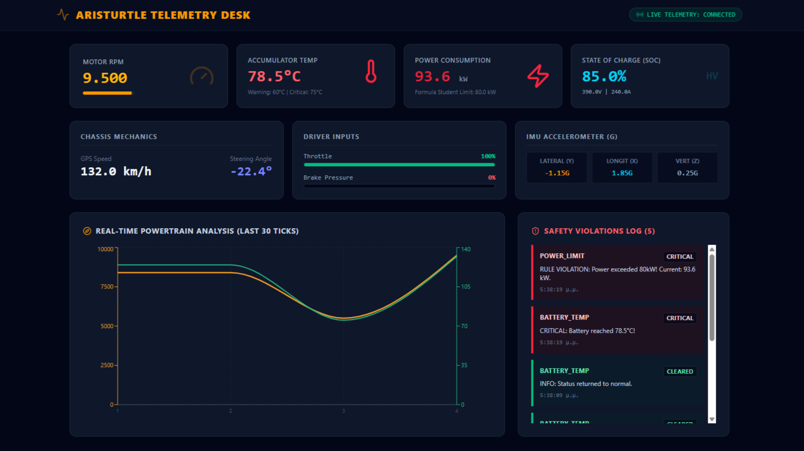

# APEX Telemetry Suite (V2 Enhanced)

A full-stack, end-to-end telemetry and observability platform designed for real-time race car data tracking, Formula Student safety threshold monitoring, and QA automation. The platform features sub-second data streaming pipelines connecting high-fidelity powertrain sensors directly to the trackside pit wall dashboard.

## Dashboard Preview (Real-Time Simulation)


*Figure 1: Real-time trackside telemetry view intercepting a critical 80kW power violation and thermal anomaly.*

## Repository Structure (Monorepo)

This repository is structured as a monoreposity containing the following engineered components:

- `backend/` — Robust Spring Boot 3 API featuring an isolated Dockerized ecosystem. It processes high-frequency telemetry sequences, executes server-side safety logic (intercepting battery temperature alerts and the statutory 80.0 kW Formula Student power threshold), and broadcasts events asynchronously via STOMP WebSockets.
- `frontend/` — Live racing telemetry dashboard built with React 19, Vite, Tailwind CSS, and Recharts. Subscribed to STOMP streams to render real-time charts (last 30 ticks), driver input status bars (throttle/brake), multi-axis G-Force indicators, and flashing pit wall violation logs.
- `qa-testing-suite/` — Quality Assurance matrix containing updated Postman collection test suites and headless integration scripts to validate 12+ sensor parameter payloads, business rule edge cases, and API contract state boundaries.

## Core System Architecture & Real-Time Data Flow

1. Ingestion: Telemetry payloads (JSON) are submitted via `POST http://localhost:8080/api/telemetry` (simulating car-to-pit hardware transmission).
2. Evaluation: The Spring Boot backend maps the 12+ parameters, calculates instant power consumption ($V \times I$), and persists logs. If limits are breached, `Violation` objects are compiled on-the-fly.
3. Broadcasting: Live metrics and safety violations are pushed asynchronously over WebSocket topics (`/topic/live-data` and `/topic/violations`).
4. Visualization: The React dashboard intercepts the frames, performing reactive UI paint updates while historical tracking pulls initialized states via `GET http://localhost:8080/api/telemetry/violations`.

## Deployments

The application is fully deployed in a monorepo cloud architecture and can be accessed through the following live links:

| Component | Deployment Platform | Live Link | Status / Notes |
| :--- | :--- | :--- | :--- |
| Frontend (UI) | Vercel | [Live Demo](https://apex-telemetry-suite-chi.vercel.app/) | Production Build (React & Tailwind) |
| Backend (API) | Render | [API Endpoint](https://apex-telemetry-suite.onrender.com/) | Live Server (Spring Boot & Docker) |

- Cold Start Delay (Render Free Tier): The backend server is hosted on Render's free tier. If the application has been inactive for more than 15 minutes, the server will automatically spin down (spin to sleep). Opening the frontend for the first time might trigger a 40-60 second delay while the instance wakes up.
- WebSocket Secure (WSS): All realtime telemetry data streams through a secure WebSocket tunnel (`wss://`) managed by Render's reverse proxy network to bypass dynamic browser CORS blocks.

## Local Development Setup & Verification

To spin up the entire telemetry environment locally and reproduce the simulation, follow these steps in order:

### 1. Backend Service

1. Navigate to the `/backend` directory.
2. Configure your local database properties or environment parameters.
3. Spin up the engine using the Maven wrapper:
   ```bash
   ./mvnw spring-boot:run
   ```
4. Confirm the API and WebSocket server are running on `http://localhost:8080`.

### 2. Frontend Interface

1. Navigate to the `/frontend` directory.
2. Install the node packages (including STOMP and Lucide dependencies):
   ```bash
   npm install
   ```
3. Establish your local `.env` configuration pointing `VITE_API_BASE_URL` and `VITE_WS_BASE_URL` to your localhost instances.
4. Launch the local development environment:
   ```bash
   npm run dev
   ```
5. Open `http://localhost:5173` to view the Aristurtle Telemetry Desk (Verify the `LIVE TELEMETRY: CONNECTED` status badge).

### 3. QA Automation & Live Simulation

1. Navigate to the `/qa-testing-suite/postman/` directory.
2. Import the `ApexTelemetry Suite` collection JSON file directly into Postman.
3. To trigger the simulated race track alert environment:
   * Execute request `1. Submit Valid Telemetry (Within Limits)` to seed baseline stable data.
   * Execute request `2. Trigger Critical Power & Temp Violations` to push extreme values ($93.6\text{ kW}$ and $78.5^\circ\text{C}$).
   * Execute request `3. Get Violations & Assert Severity` which queries `http://localhost:8080/api/telemetry/violations` to verify that the backend successfully generated and persisted the `CRITICAL` safety data rows.
4. Keep the frontend dashboard open at `http://localhost:5173` simultaneously to witness the telemetry graph dynamic spikes and flashing red alerts interface update instantly via WebSockets without page reload.
